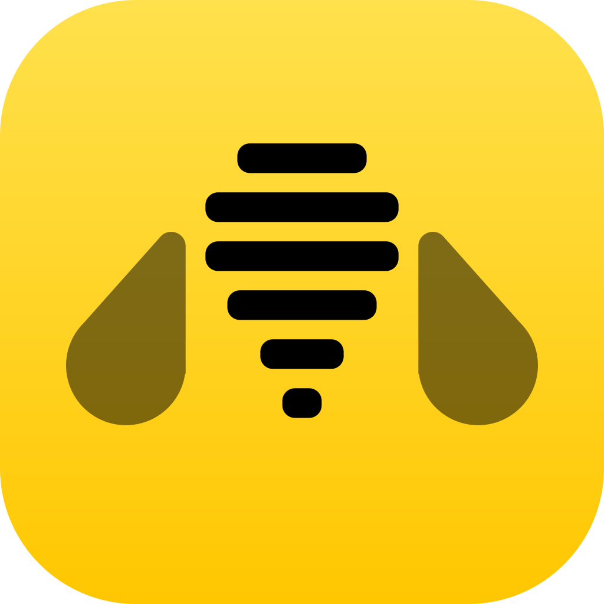
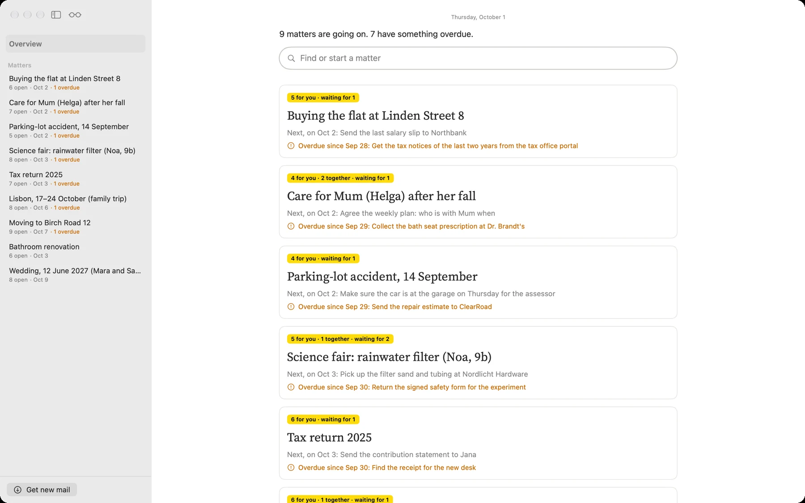

<p align="center"></p>

<h1 align="center">Causabee</h1>

<p align="center"><strong>Every matter. In its place.</strong><br>
A Mac app that turns scattered mail, documents and screenshots into clear matters:<br>
what comes next, who does what, and by when.</p>

<p align="center">
<a href="https://causabee.github.io/causabee/">Website</a> ·
<a href="https://github.com/causabee/causabee/releases">Download the beta</a> ·
<a href="https://causabee.github.io/causabee/privacy.html">Privacy</a>
</p>



## What it does

A trip, a move, care for a parent: each one arrives in pieces — a mail here, a PDF there, a
screenshot you meant to keep. Causabee puts the pieces together.

- **One page for each matter.** The next step, a short summary, your notes and every task.
- **Who does what, and by when.** Tasks are yours, shared, or someone else's you're waiting for.
  Dates and tasks go to Calendar and Reminders with one click, and stay in step both ways.
- **Every fact has a source.** Each task and date links back to the mail it came from.
- **Ask about a matter.** Answers come with their sources, and a suggestion becomes a task in one click.
- **Mail, files and screenshots.** Put a label on a mail in Gmail or iCloud, or drag in a PDF or a
  screenshot. A matter keeps the language its mail was written in.

## Private by design

- Your mail and files stay on your Mac.
- Before any text goes to an AI, names, addresses and numbers are replaced on the Mac — and only
  when you click. If the disguise can't be built, nothing is sent.
- You pick Claude, OpenAI or Mistral for each job, with your own API key in the Keychain. Every
  answer shows what it cost.
- No server, no account, no analytics. The whole policy is on the
  [website](https://causabee.github.io/causabee/privacy.html).

## Try it

[Download the beta](https://github.com/causabee/causabee/releases) (macOS Sequoia 15 or later),
open it, and click **Try the demo** at the end of the introduction: nine made-up matters, with
nothing to set up. For your own mail you need an IMAP account — Gmail needs an app password — and
an API key from Anthropic, OpenAI or Mistral.

Causabee is in beta. Not in the beta yet: iCloud sync, and Sign in with Google
([docs/google-sign-in.md](docs/google-sign-in.md)). Bugs and ideas are welcome as
[issues](https://github.com/causabee/causabee/issues).

## Building the Mac app

Open `App/Causabee.xcodeproj` in Xcode and run the **CausabeeApp** scheme (macOS 15 or later).
To sign it yourself, choose your own team and a bundle identifier of your own under Signing &
Capabilities; iCloud needs a container of your own too. Without signing it still runs, on the
Mac it was built on, with iCloud off.

From the Terminal, without signing:

```sh
xcodebuild -project App/Causabee.xcodeproj -scheme CausabeeApp CODE_SIGNING_ALLOWED=NO build
```

`scripts/release.sh` makes a signed, notarized release; see the top of that script.

## License

MIT — see [LICENSE](LICENSE). The Source Serif 4 font is under the SIL Open Font License
([App/Resources/Fonts](App/Resources/Fonts/SourceSerif4-LICENSE.md)).

---

*The rest of this README is the working notes from building Causabee: the mail pipeline and the
`matter-spike` tool it started as, the data model, the app, and the tests. The plan is in
[plan.md](plan.md).*

## What is built

| Step | Stage | State |
| --- | --- | --- |
| 1 | Parse `.eml` — headers, body, attachments | built |
| 2 | Bulk filter, rules only, no AI | built |
| 3 | Entity detection on the device | built |
| 4 | Pseudonymize — `placeholder` or `standin` | built |
| 5 | Classify and extract via the API — `--classify` | built |
| 6 | Restore | built |
| 7 | Cluster into candidate matters | not yet |
| 8 | Report against the golden set | not yet |

Nothing makes a network call unless `--classify` is passed, and then only the disguised text of
mail that got past the bulk filter is sent. The key is read from `ANTHROPIC_API_KEY` or from a
gitignored `.env`.

## The golden set

Step 8 measures the pipeline against 50 emails you have labelled by hand. Making that file is
its own job, with its own guide: **[docs/golden-set.md](docs/golden-set.md)**.

```sh
swift run matter-spike labels Samples/private/mail --out labels.csv
swift run matter-spike check  Samples/private/mail --labels labels.csv
```

## Running the spike

```sh
swift run matter-spike Samples/mail --log decisions.jsonl
swift run matter-spike Samples/mail --mode standin
```

Every mail that gets past the bulk filter is disguised, and the log carries the disguised text
under `disguise` — what would be sent, so a leak can be seen rather than inferred. The whole
folder is learned before any mail is disguised, so a name found in one mail is replaced in all
of them. `mapping.json` holds the originals, is read and added to on every run, and is
gitignored.

`Samples/mail` is a small synthetic set — invented people, `.example` domains — so the
pipeline can be tried without pointing it at a real mailbox. For a real run, export mail from
Mail.app by selecting messages and dragging them into a folder, then pass that folder.

Useful flags:

- `--no-tagger` — rules only, to see what the on-device tagger is actually adding
- `--language de` — force the tagger's language instead of detecting it per mail
- `--mode standin` — realistic stand-ins instead of `[Person A]`; question 3 compares the two
- `--show 1` — print the first decision as formatted JSON

### Asking Claude

```sh
swift run matter-spike run Samples/private/mail --dry-run          # write requests.jsonl, send nothing
swift run matter-spike run Samples/private/mail --classify --limit 10
swift run matter-spike run Samples/private/mail --classify --model haiku --mode standin
swift run matter-spike review                                       # review.html, beside your labels
```

Mails go in date order, each told the matters found so far. Answers are cached in
`.matter-cache/`, so a re-run with the same prompt costs nothing and a stopped run resumes. The
prompt and schema are in `Sources/MatterCore/Prompts/`, versioned; the version is in every log line.
`review.html` is made from real mail and is gitignored — open it from disk, never share it.

Don't run this on the folder you are still labelling: the point of the golden set is that it
was written from the mail rather than from the tool's opinion of it.

## Reading the label (Phase 2)

In the manual edition you put one label, `Causabee`, on the mail that starts something.
`fetch` reads that label and nothing else, finds the replies that came after it, and runs it all
through the same steps as `run`.

```sh
swift run matter-spike login --account you@gmail.com     # once: checks the password, saves it
swift run matter-spike fetch                              # read the label, disguise, log
swift run matter-spike fetch --classify --since 2026-09-01
```

- **Read-only, for real.** The client can only send the commands in `IMAPClient.allowed`. A
  folder is opened with `EXAMINE`, which the server keeps read-only, and mail is read with
  `BODY.PEEK[]`, so it stays unread. There is no command in it that moves, flags or deletes.
- **No writes at all.** Causabee never writes to the mailbox: a draft opens in Mail and the owner
  sends it; a document scanned on the iPhone is kept on the iPhone, in Files (On My iPhone ›
  Causabee), and sorted in like a file brought in with the paperclip.
- **Build with `scripts/build.sh`**, not `swift run`: it signs both programs with the personal
  development certificate under fixed identifiers, so macOS asks once for the Keychain and not
  again after every rebuild. Then start `.build/debug/Causabee` and `.build/debug/matter-spike`.
- **The password is in the Keychain**, as "Causabee IMAP". Never in a file, never in `.env`.
  For Gmail it is an app password (myaccount.google.com/apppasswords; it needs 2-step
  verification). After a rebuild macOS may ask whether `matter-spike` may use it: say
  *Always Allow*.
- **Replies follow by thread.** Gmail labels a conversation as it is when you label it; a reply
  next week has no label. So replies are looked for in All Mail by Gmail's own thread id. On
  other servers, by `References` and `In-Reply-To`, round by round, in the inbox and in sent
  mail. A mail that shares only a subject is not fetched.
- **Your label is not overruled.** The bulk filter does not throw out labelled mail, even from
  a `noreply@` sender. It still decides for a reply that came in by thread alone.
- **Each mail is classified once.** A mail already answered in the log keeps its answer — even
  after the disguise or the prompt changed — and is not sent again; only new mail is. Before
  anything is sent, `fetch` says how many mails and about what it costs, and waits for a yes
  (`--yes` for unattended runs). `--reclassify` sends everything again, and asks first. At
  about six labelled mails a day that is about $0.20 a day.
- **Only new mail is read.** From Gmail, first only the Message-ID of each labelled mail; a mail
  already answered (or stopped as bulk) is not downloaded again. `fetch --classify --import`
  reads, asks, classifies and puts it into the store in one step. In the app, "Neue Mails
  holen" at the bottom of the sidebar does the same: it lists what is new and what it would
  cost, and sends only on "Einordnen".
- **Nothing is stored.** Mail is read into memory each time. The log points back at each mail
  as `imap://imap.gmail.com/Causabee;UIDVALIDITY=…/;UID=…`.

## Matters (the data model)

A classified log becomes matters in a local store, `matters.store` (SwiftData, gitignored,
made from real mail):

```sh
swift run matter-spike import --log decisions-fetch.jsonl
swift run matter-spike matters                       # every matter, with open to-dos
swift run matter-spike matters hausverwaltung        # one matter's status
swift run matter-spike merge reisestornierungmutter reisestornierung
swift run matter-spike rename reisestornierung "Reisen stornieren"
```

- **One to-do per thing to do.** A to-do asked for in six mails is one line, with six sources.
  A later mail that shows it done closes it.
- **Every fact has a source**: the mail it came from and the words it was read out of.
- **Import is safe to repeat.** A mail already in the store adds nothing, and a to-do you
  reopened is not closed again by a mail it has already seen.
- **A matter can be closed, and nothing is deleted.** `close <matter>` (with `--done` to tick its
  open to-dos) takes it out of the list and the assistant; `reopen` brings it back, and opens
  again exactly what closing ticked. Mail that comes for a closed matter still arrives in it,
  and the matter says so. In the app: "Sache abschließen" next to the title.
- **Merged and renamed matters keep their old names as aliases**, so mail the model still files
  under `reisestornierungmutter` arrives in the merged matter.
- **Each person once.** `Frau Dr. Petra Lindner (Mimi)`, `Doktor Petra Lindner` and
  `Petralindner` are one party, with the other spellings listed. Roles are kept per matter, so a
  role from the roofer's mail never shows in the house. You are never a party: `--me`, or
  by default the sender of most mail in the log.
- **Likely matches are asked, not done.** `parties <matter>` lists a matter's people and the
  merges worth asking about, each with its reason:

  ```sh
  swift run matter-spike parties hausverwaltung
  swift run matter-spike same hausverwaltung 2 3 4            # yes to suggestions 2, 3 and 4
  swift run matter-spike same hausverwaltung "Mimi" "Petra Lindner"
  swift run matter-spike notsame hausverwaltung "Wolfgang" "Wolfgang Kurz"
  swift run matter-spike rules                                # what you told it, and a switch
  ```

  A merge is a rule: the next mail's spelling goes to the same party, the rule counts how often
  it was used, and `rules --off <n>` stops it.
- The pipeline's own record of a mail is a `Judgement`. `Decision` is the model's word for
  something *you* decided, and why.

## The Mac app

**Causabee.app** is built with Xcode from `App/Causabee.xcodeproj` — the same code as
`Sources/Causabee`, signed with the personal development team, icon in `App/Resources`:

```sh
xcodebuild -project App/Causabee.xcodeproj -scheme CausabeeApp -derivedDataPath .build-app -allowProvisioningUpdates build
open .build-app/Build/Products/Debug/Causabee.app
```

Its data lives in `~/Library/Application Support/Causabee` — store, name list, record, mail
texts, files — and `matter-spike` uses the same folder once a store is there (`--data` names
another). The API keys are pasted in its settings (⌘,) and kept in the Keychain.

**iCloud.** In the settings: *Off*, *Test* (made-up data, its own store in
`Application Support/Causabee-Test` and the container `iCloud.de.chille.causabee.test`) or
*On* (the store mirrored into the owner's private CloudKit database,
`iCloud.de.chille.causabee`). What syncs: matters, to-dos, dates, people, notes, links, digests,
the assistant's history. What stays on the Mac: full mail texts, files, the name list, the keys.
The command line opens the same store without iCloud; its changes go up when the app next starts.

```sh
swift run Causabee --store matters.store                     # the store import wrote
swift run Causabee --store matters.store --open hausverwaltung
```

Two surfaces, as in the wireframes (C1–C4). The **assistant** lists every matter that has
something open, what is overdue first, each with a door into its status. A matter's **status**
has its to-dos as mine, ours and waiting-for, with a box to tick; the dates; the parties, with
the "same person?" suggestions as cards and a name dragged onto another to merge them; and the
history. Every row has **reden**, which takes it into the assistant, pinned above the field.
"aus der Mail vom …" opens the original in Mail — the one door out, and only on a click.

**Notes.** Under a matter's summary, "Notizen" holds your own words: what was agreed on the
phone, what to keep in mind. They stay on the Mac until you ask the assistant something; then
they go with the matter's facts, and — because nothing disguised them before — they are searched
for names like a typed question, as a to-do's own note is.

**Next step.** On top of a matter, "Als Nächstes" says the one thing to do now, and why. It is
worked out on the Mac, for nothing: your own late to-dos first, then an appointment or a deadline
in the next three days, then asking again for what is late from others, then your own soonest
to-do, then waiting. A step that is a message — nachfassen, schicken — has "Nachricht schreiben".
"Besser vorschlagen" asks Claude instead (about 3 cents, pseudonymised, your
notes included); its step is shown until a to-do comes in or is ticked off.

**What waits for what.** Right-click a to-do → "Wartet auf …", or "Erst nach" in its editor, or
tell the assistant ("der Nachweis geht erst nach der Antwort"). A to-do that waits moves to
"Erst danach" at the end, is not counted as overdue, and says what it waits for; when that is
done, it comes back and says "jetzt dran".

**Links.** A Google Doc, a sheet, any page: "+ Link" in a matter (a link just copied in the
browser is filled in), a drag from the browser onto the matter, or the task editor. A link can go
with one task, and shows on it as a chip. Causabee never opens a link itself — a private doc
shows it only a login — so the kind comes from the address and the name is yours. The assistant
hears the name and the kind, never the address: whoever has the address of a shared doc may open it.
An address typed into the assistant is sent as `[Link 1]`, and "Link speichern?" keeps it.

Links in mails are found on the Mac, for nothing: a new mail's when it is taken in, and the older
mails' on "In den Mails nach Links suchen", which reads them again from Gmail, read-only. What a
signature, a quoted older mail or a newsletter footer holds is left out — unsubscribing, tracking,
social media, privacy and legal pages, pictures, bare homepages. The rest is offered under
"Aus den Mails": "Behalten", or "Nicht wichtig", and it is not offered again. The mail text the
model reads is not touched by this, so nothing is sent again.

**Asking the assistant.** A question goes to Claude with the facts of the pinned matter, or of
every matter, disguised with `mapping.json` exactly as the mail was. Only what you typed is
searched for new names — every name in the facts came back from the mail's disguise already —
and a known name is disguised in every spelling (`Süß`, `Süss`, `Suess`). The answer is short
lines, each citing the facts it rests on as chips that open the matter; what it cannot see it
says so; what you could do comes as a card you tick, and only a tick changes the store. Under
each answer: what it saw, the time, the cost, and exactly what was sent. About $0.05–0.10 a
question with Opus 5. The thread lasts as long as the app is open.

```sh
swift run matter-spike ask hausverwaltung "Was ist mit Herrn Brenner?" --dry-run   # what would be sent, and a leak check
swift run matter-spike ask hausverwaltung "Was ist mit Herrn Brenner?"
```

**The window** is three columns: the matters, the assistant — always there, half the space,
showing the open matter's part of the one thread, which is kept beside the store — and the
overview or a matter.

**Chat screenshots.** In the assistant, the paper clip, a drag or ⌘V brings one in. It is read
on the Mac (Vision) as a chat: name, participants, who said what at which minute, day markers,
the owner's own bubbles on the right; the status bar, the input field and what sits above the
chat are named and left out, and a message cut off at the top is said to be. Nothing is sent
until "Einordnen"; what comes back is a card — a new matter with a name to edit, or one that
exists — to take in or throw away. A file in the owner's folders stays where it is; a pasted
one is copied into `Anhänge/`. `matter-spike screenshot <image>` reads one from the terminal
and sends nothing.

**Mails and PDFs, dropped in.** The same door takes a mail saved as `.eml` — read like a
labelled one, and free if the label already answered it — and a PDF, read page by page: from
its text layer where it has one, by text recognition on the Mac where it is a scan, and each
such page said so; a page that gives nothing is said to be unread. "+ Neue Sache" in the
sidebar makes a matter from nothing but a name; "Neue Sache: …" in the assistant does the same
as a card, with the first to-dos beside it.

**Drafts.** Asked for a message, the assistant writes it as a card to edit, and "In Mail
öffnen" opens Mail with it — the address taken from that person's mail on this Mac. Causabee
never sends; that button is the owner's. A name typed a letter off ("Geor") is read as the one
person it almost is, on the device, and the thread says so.

Not yet: speaking instead of typing, Reminders and Calendar, PDFs and photos of letters.

## Other models, tested

`matter-bench` scores a model against the store — which holds the owner's corrections — on the
same text Opus was sent. Result on 186 labelled mails (2026-09-28): Apple's on-device model and
Qwen 3 8B (MLX, in `LocalBench/`) are too weak to read the mail (24 % and 78 % right matter, a
fifth of the to-dos); Mistral Large 3 sorts almost as well as Opus for $0.34 instead of $6.28,
but in a blind comparison of 20 mails Opus's to-dos were better in about one mail in three.
So Opus stays for the mail and the assistant; Mistral is for one-off runs from the terminal.

```sh
swift run matter-spike fetch --log decisions-mistral.jsonl --model mistral --classify   # MISTRAL_API_KEY in .env
swift run matter-spike fetch --log decisions-mistral.jsonl --model mistral --strict --classify   # fewer, real to-dos
swift run matter-bench --compare decisions-mistral.jsonl --name mistral                 # scored against the store
swift run matter-bench --compare decisions-mistral.jsonl --name Mistral --blind 20      # review-blind.html, to judge blind
```

## Tests

```sh
./scripts/test.sh
```
